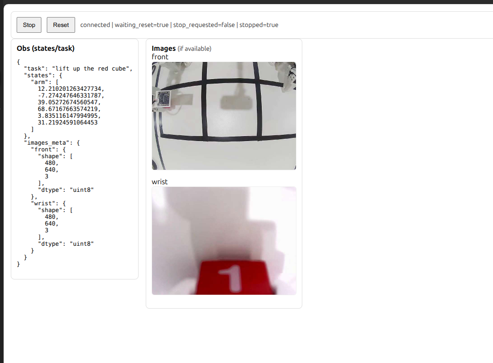

# SO101 抓方块参考程序

这是一个基于 [ManiSkill](https://github.com/haosulab/ManiSkill) 实现的 SO101 抓取方块的任务，并使用强化学习或者运动规划得到成功轨迹的参考程序。

注意，这个参考程序只在 Linux 系统上测试过有效性,对于非 Linux 系统 GUI 显示，机械臂场景预览一般不会影响，会影响：
- 运动规划：由于运动规划库不兼容所以无法使用，需要自行寻找支持的其他平台的运动规划库替换部分函数
- RL：非 Linux 系统无法并行可能需要自行调整并行方式，参考代码使用的 TDMPC2 要求环境并行数量较少 (32)，或许可以通过在 CPU 上并行完成训练

## 更新

为了加快真机部署流程，加入 server-client 结构的实现样例和通过重放数据集轨迹的 FakeLeRobotEnv。下文中关于真机部分的说明。

为了方便之后的测试,我们提供了一份 docker 打包指南,最终真机测试的策略请参考这个打包指南提交.

加入真机部署代码的样例，仿真评测流程可以参考真机评测的代码。其中真机部署的供参考的策略使用的是与 submodule 相同版本的 ACT 策略。
如果在尝试 LeRobot ACT 在仿真中部署失败可以参考 `grasp_cube/real/act_policy.py` 的实现。**其中非常重要的一点是 LeRobot 除了载入策略外，还需要载入数据的预处理器和后处理器。**

建议每次拉取 github 更新时重新 uv sync.

由于 LeRobot 版本变动较大，我们提供了助教使用的 LeRobot 分支并更新了 LeRobot 数据集使用参考。

我们更新了 URDF [so101_new](grasp_cube/assets/robots/so101/so101_new) 主要修复了一下问题：
- 来源于之前下发的 [so101_old](grasp_cube/assets/robots/so101/so101_old) 的镜像，与真实机器人一致
- 优化夹爪部分的碰撞网格，更容易抓到物体
- 优化部分连杆的转动惯量，让仿真更加稳定
- 增加两个位于夹爪末端辅助节点用于计算 TCP (工具中心)，方便进行规划
  
## 安装

```
uv sync
```

如果需要使用 RL，运行

```
uv pip install -r rl/tdmpc2/requirements.txt
```

如果需要使用 LeRobot, 运行

```
git submodule update --init --recursive
cd external/lerobot
uv pip install -e .
```

## 真机

我们将使用 server-client 的形式在真机上测试模型,这样做的好处是将你的模型和环境完全解耦,防止一些由于耦合带来的风险.

### 客户端

环境作为客户端,我们在目前的代码仓库中提供了最后用于测试的真机环境封装,和用于调试的模拟真机环境,在进行真机测试以前,可以用模拟真机环境去检验模型侧的封装是否正确.

客户端这一侧,推荐新建一个 python 环境,安装我们提供在 submodule 里的 LeRobot 库和下面的 `env_client` 库.

```
uv pip install -e packages/env-client 
```

模拟真机环境的运行方式为:

```
uv run grasp_cube/real/run_fake_env_client.py --env.dataset-path datasets/lift
```

其中 dataset-path 为我们提供的 LeRobot Dataset.

成功运行后,你会看到

```
[MonitorWrapper] Panel: http://0.0.0.0:9000
[EvalRecordWrapper] Output dir: outputs/eval_records/20251226_124302
Waiting for server at ws://0.0.0.0:8000...
Connection refused, retrying in 5 seconds...
```

你可以打开网页 http://0.0.0.0:9000 看到交互界面,其中 Stop 会直接向环境发送终止的指令, 点击 Stop 时, 会让你选择这次评测是否成功,点击完成后,环境会进入等待 Reset 状态,在点击 Reset 后会执行下一次评测.



对于模拟真机环境来说,默认在 `outputs` 下还会输出策略输出 action 与数据集 ground truth actoin 的对比,可用于检验你们的 I/O 是否一致.

### 服务器

服务器侧你可以完全使用你自己的依赖, 但仍然需要安装 

```
uv pip install -e packages/env-client 
```

请参考目前 `grasp_cube/real/act_policy.py` 和 `grasp_cube/real/serve_act_policy.py` 将你自己的策略封装为可以运行的服务器.

在提交时,请上传 docker 镜像,参考 [Packaging Your Policy Server with Docker](docker_tutorial.md).

## 初步使用

### 机械臂

机械臂在 [so_101.py](grasp_cube/agents/robots/so101/so_101.py) 中完成完成注册导入，具体参考教程 [Custom Robots](https://maniskill.readthedocs.io/en/latest/user_guide/tutorials/custom_robots.html).

预览 ManiSkill 中导入的 SO101 机械臂：

```
uv run hello_robot.py
```

参考结果：


其中机械臂上的绿点和红点是上文提到的用于计算 TCP 的辅助节点，可以自行注释掉 URDF 中对应 link 进行删除。

### 任务

任务在 [pick_cube_so101.py](grasp_cube/envs/tasks/pick_cube_so101.py) 中定义，参考 [Tasks](https://maniskill.readthedocs.io/en/latest/contributing/tasks.html) 的教程。

预览样例代码中 PickCubeSO101 任务：

```
uv run hello_pick_cube.py
```

参考结果：


其中蓝色区域为方块初始范围，绿色无透明度的球为目标位置，任务内容是红色方块和绿色目标在蓝色区域内随机生成，机械臂需要将红色方块移动到目标位置并且保持抓握和静止。

其中蓝色区域范围等任务参数，可以在 [pick_cube_so101.py](grasp_cube/envs/tasks/pick_cube_so101.py) 中找到相应位置调节或关闭可视化。

## 运动规划

实现一个基本的运动规划器 [base_motionplanner/motionplanner.py](grasp_cube/motionplanning/base_motionplanner)，支持输入末段目标位姿，返回末段位姿的路径点。

在 [pick_cube.py](grasp_cube/motionplanning/so101/solutions/pick_cube.py) 中实现 PickCubeSO101 环境的具体解法。

运行下面指令

```
uv run -m grasp_cube.motionplanning.so101.run -n 100
```

可以进行 100 次运动规划，最终参考输出为

```
proc_id: 0: 100%|█| 100/100 [00:27<00:00,  3.62it/s, success_rate=0.56, failed_motion_plan_rate=0.284, avg_episode_length=97.7...
```

并会在 demo 中生成对应的 H5 文件。

使用 `--vis` 参数可以可视化收集过程，参考如下


其中包含目标夹爪位姿的可视化，更多参数可以参考 [run.py](grasp_cube/motionplanning/so101/run.py) 文件。

## RL

### TDMPC2

TDMPC2 是一个 Model-based RL 算法具有较高的样本效率。

运行 state-based RL 训练：

```
cd rl/tdmpc2
uv run train.py env_id=PickCubeSO101-v1
```

最终输出：

```
eval    E: 19,968       I: 1,000,000    R: 30.16        S: 1.00         T: 6:55:02 
train   E: 19,968       I: 1,000,000    R: 30.19        S: 0.94         T: 6:55:02 
```


运行设备 RTX 4090 LapTop，运行显存在 5G 以内。

一些关键的时间点:
- 第一次有成功率，E, I 大约为 400, 20K 左右，用时 10min
- 成功率开始稳定在 80% 以上，E, I 大约为 4000, 200K 左右，用时 80 min

## LeRobot Dataset

将 Web Learning 上的数据集下载到本地，运行 LeRobot 官方提供的数据集可视化功能

```
lerobot-dataset-viz \
    --repo-id eai/lift \
    --root ./datasets/lift \
    --mode local \
    --episode-index 0
```

参考结果如下


运行 `hello_real_robot.py` 可以看到现实中轨迹在仿真中的重播效果，并输出仿真和现实世界的差别，具体可以使用 `--help` 查看所有指令。

```
uv run hello_real_robot.py --root ./datasets/lift --episode-index 0
```

参考结果


# 声明

该 codebase 大部分代码参考自 ManiSkill 官方仓库。